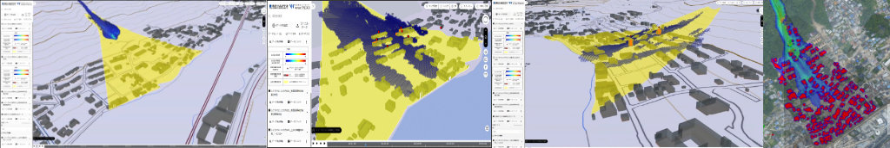

# 家屋倒壊判定モジュール

本リポジトリでは、Project PLATEAUの令和4年度のユースケース開発業務の一部である
UC23-02「精緻な土砂災害シミュレーション」に関する成果物である「家屋倒壊判定モジュール」のソースコードを公開しています。

「精緻な土砂災害シミュレーション」により、PLATEAUの3D都市モデルから得られる建物の形状や配置、さらに、
構造種別等の属性情報を考慮した精度の高い土石流シミュレーションが実施可能となります。

## 目次

このページには、以下の内容を記載しています。

* 家屋倒壊判定モジュールを用いた土石流シミュレーションの実行方法
* 家屋倒壊判定モジュールのカスタマイズ方法

土石流シミュレーションには、[iRIC Morpho2DH](https://i-ric.org/solvers/morpho2dh/)（以下、「Morpho2DH」と呼びます）というプログラムを用います。
一方、家屋倒壊判定モジュールを用いた土石流シミュレーションを実行するには、
オリジナルのMorpho2DHをカスタマイズする必要があります。
そのため、最初にオリジナルのMorpho2DHの環境構築と使い方を説明し、その後に、
今回の家屋倒壊判定モジュールを用いた土石流シミュレーションの実行方法を説明します。

#### 1. [オリジナルiRIC Morpho2DHの使い方](manual/originalSimuHowTo.html)
#### 2. [家屋倒壊判定モジュールを用いた土石流シミュレーションの実行方法](manual/bldgCollapseSimuHowTo.html)
#### 3. [家屋倒壊判定モジュールのカスタマイズ方法](manual/customizeModule.html)
