# 1. オリジナルiRIC Morpho2DHの使い方

ここでは、iRIC Morpho2DHのソルバーの稼働環境を準備する手順をお示します。

## iRIC Morpho2DHの概要
iRIC Morpho2DHは、は平面二次元の土石流・泥流モデルを主体とした解析ソルバーであり、斜面崩壊を初期条件とした土石流・泥流の流動・堆積過程を表現可能なモデルです。砂防ダム，堰，家屋などの構造物や地盤の浸食深さの平面分布などを考慮した解析が可能です。
詳細は[iRIC公式サイト](https://i-ric.org/ja/)を参照してください。

## iRIC Morpho2DHのインストール
iRIC Morpho2DHのインストールおよびセットアップ手順は以下のとおりです。
* 1 [iRIC公式サイトにアクセス](https://i-ric.org/ja/)し、iRICの会員登録を行ったうえで、iRIC-v4をインストールしてください。※既にv4以外のバージョンのiRICお持ちの方は、改めてv4をインストールしてください。
* 2 [家屋倒壊判定モジュール](../manual/bldgCollapseSimuHowTo.html)を、PCの以下のフォルダー内に貼り付けます。

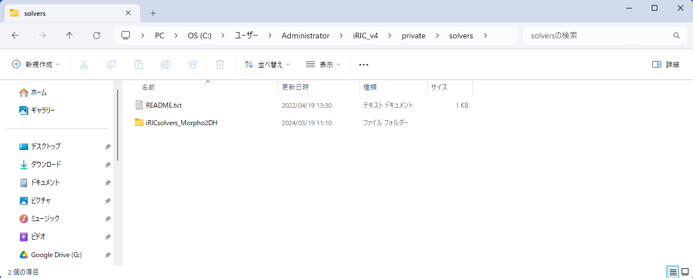

* 3 iRIC(v4)を立ち上げ、「iRIC スタートページ」から「新しいプロジェクト」を選択し、「ソルバーの選択」で「Morpho2DH PK12」を選択

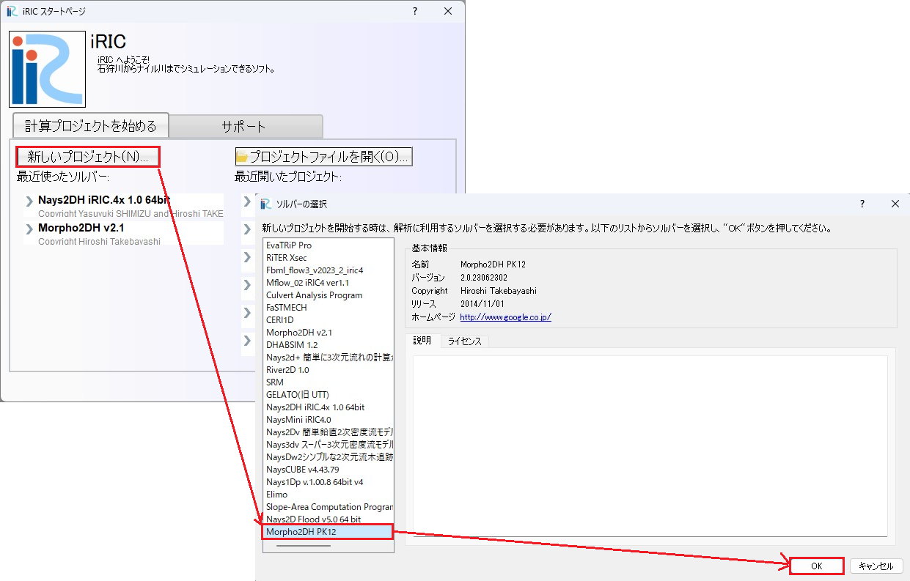

## 土石流シミュレーションの実行方法
家屋の倒壊状況等を加味した土石流シミュレーションのフローを以下に示します。
既存のiRIC Morpho2DHの基本的な操作は、[マニュアル](https://i-ric.org/solvers/morpho2dh/)および[チュートリアル](https://i-ric.org/solvers/morpho2dh/)も併せて参照してください。

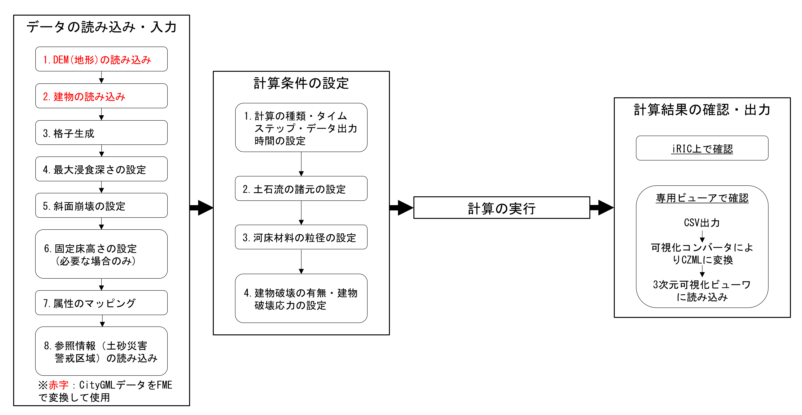

### 入力データの準備
iRICの計算に必要なデータのうち、DEMデータ（地形データ）および建物データは、CityGMLデータをFMEにより変換して使用します。具体的には、地形LOD1データをxyz（点群）データに、建築物LOD1データをシェープファイルに変換します。
FMEを用いた変換方法は[こちら](../resources/originalSimuHowTo/01_FMEによるCityGMLデータの変換方法.pdf)を参照してください。また、FMEによる地形LOD1データの変換のサンプルは[こちら](../resources/originalSimuHowTo/01_地形LOD1データの変換.fmw)を、建築物LOD1データの変換のサンプルは[こちら](../resources/originalSimuHowTo/02_建築物LOD1データの変換.fmw)を参照してください。

### データの読み込み・入力
ここでは、1. DEMデータ（地形データ）の読み込み、2.建物データの読み込み、3.格子生成、4.浸食深さの設定、5.斜面崩壊の設定、6.固定床高さの設定（必要な場合のみ）、7.属性のマッピング、8.参照情報（土砂災害警戒区域）の読み込みを行います。
1および3～7については、既存のiRIC Morpho2DHの機能と同様なので、チュートリアルも参考としてください。

#### 1.DEMデータ（地形データ）の読み込み
「オブジェクトブラウザー」の中の「河床位」を右クリックし、「インポート」を選択した後に「点群データ」を選択します。次に、読み込みたいDEMデータ（xyz形式）を選択します。「インポート設定」では、先頭行が座標値でなく「x,y,z」となっている場合、「レコードオプション」の「読み飛ばすヘッダ行数」を1にします。

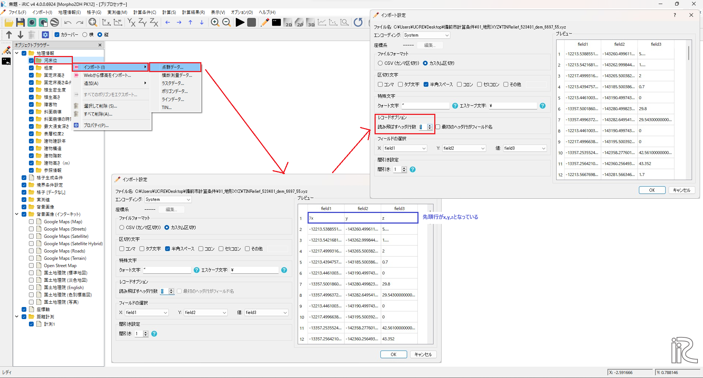

#### 2.建物データの読み込み
既存のiRIC Morpho2DHにない機能です。「建物建設年」「建物構造」「建物高さ(m)」の3つをそれぞれ読み込む必要があります。以下、「建物建設年」を例に読み込み方法を説明します。
「オブジェクトブラウザー」の中の「建物建設年」を右クリックし、「インポート」を選択した後に「ポリゴンデータ」を選択します。次に、読み込みたい建物データ（シェープファイル）を選択します。「ポリゴングループ インポート設定」では、値は「シェープファイルの属性から読み込む」を選択し、「建物建設年」を選択します。
※「建物構造」「建物高さ(m)」についても、同じ要領で読み込みます。

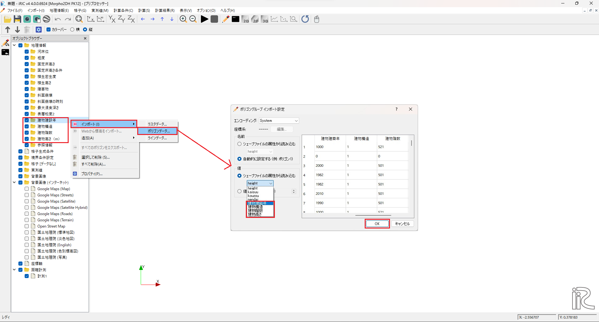

#### 3.格子生成
2m×2mの格子（メッシュ）を作成します。基本的には、チュートリアルのp5～p7を参照してください。格子生成ダイアログ（チュートリアルのp6）における「格子数・格子の大きさの決定」では、各格子の大きさ（dI, dJ）が2mとなるよう、nI,nJの値を調整してください。
なお、格子の中心線（チュートリアルのp6）の向きは、土石流の流れの向きと概ね一致させるようにしてください。
※地形図は、「オブジェクトブラウザー」の中の「背景画像（インターネット）」の中の「国土地理院（標準地図）」をチェックすると表示されます。

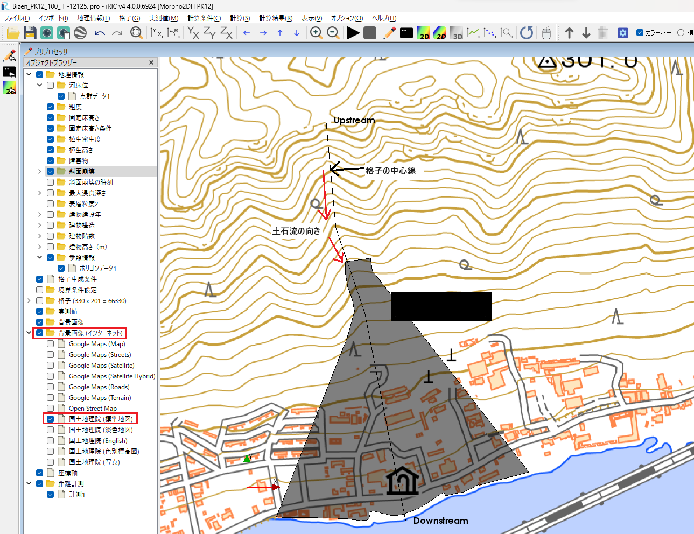

#### 4.浸食深さの設定
地盤の浸食深さ(m)の設定方法は、チュートリアルのp10を参照してください。
浸食深さ(m)は、土石流に関する基礎調査調書のデータを用いて、浸食深を渓流長で加重平均したものを使用することを基本とします。設定方法は、浸食深さの設定方法を参照してください。

#### 5.斜面崩壊の設定
斜面崩壊の場所と大きさの設定方法は、チュートリアルのp12～p13を参照してください。斜面崩壊箇所は、渓流の最上流端（尾根付近）とすることで、土石流による被害がより大きい想定になります。斜面崩壊の深さは、0.3mを基本とします。
※地形図は、「オブジェクトブラウザー」の中の「背景画像（インターネット）」の中の「国土地理院（標準地図）」をチェックすると表示されます。

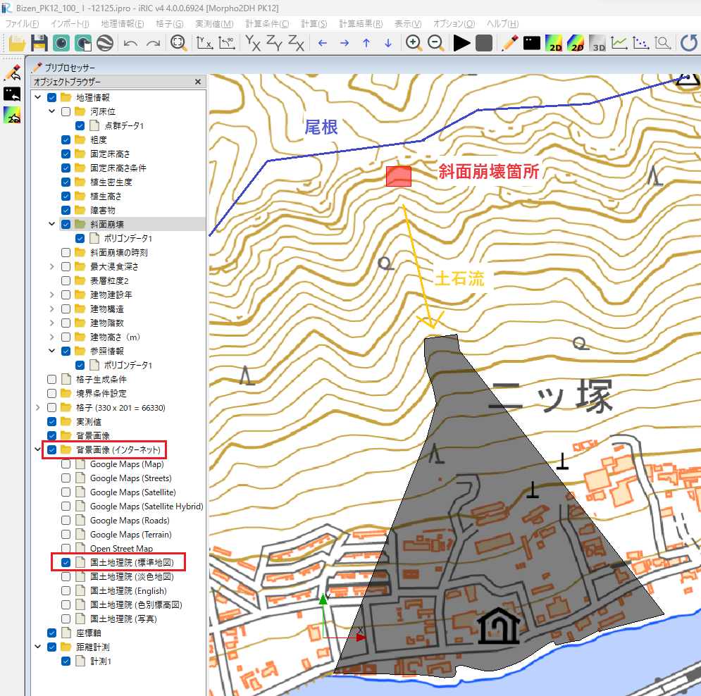

なお、渓流が複数ある場合は、渓流長が最も長い渓流の最上流端を斜面崩壊箇所とすると、土石流による被害がより大きい想定になります。土石流に関する基礎調査調書がある場合は、主渓流（想定土石流流出区間）の最上流端としてください。

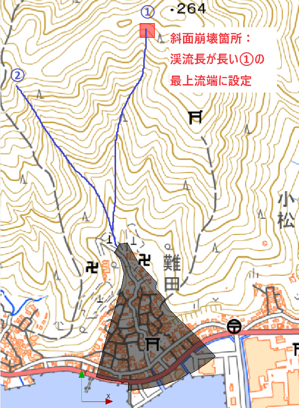

#### 6.固定床高さの設定（必要な場合のみ）
既設砂防堰堤などの浸食されない河川・砂防構造物が存在する場合、チュートリアルのp29～p32の方法で固定床高さを設定してください。この場合、「計算条件の設定」→「計算条件（土石流・泥流）」において、「固定床高さ」は「使用する」を選択してください。
地表面基準の固定床高さは、土石流に関する基礎調査調書などをもとに、既設砂防堰堤の地表面からの高さを入力してください。

#### 7.属性のマッピング
1～6で読み込み・入力したデータを2m×2mの格子（メッシュ）に落とし込むため、「格子」タブの「属性のマッピング」→「実行」をクリックし、属性のマッピングを行います。
※属性のマッピングを行った後、1～6の読み込み・入力データを変更した場合、変更した項目について再度属性のマッピングを実施してください。

#### 8.参照情報（土砂災害警戒区域）の読み込み
計算に必要なデータではありませんが、参照情報として土砂災害警戒区域を読み込むことで、[計算結果の確認方法](..)において計算結果と土砂災害警戒区域を重ね合わせて表示することができます。
「オブジェクトブラウザー」の中の「参照情報」を右クリックし、「インポート」を選択した後に「ポリゴンデータ」を選択します。次に、読み込みたい土砂災害警戒区域（シェープファイル）を選択します。
※土砂災害警戒区域（シェープファイル）は、[国土数値情報「土砂災害警戒区域データ」](https://nlftp.mlit.go.jp/ksj/gml/datalist/KsjTmplt-A33-v2_0.html)をダウンロードしてください。

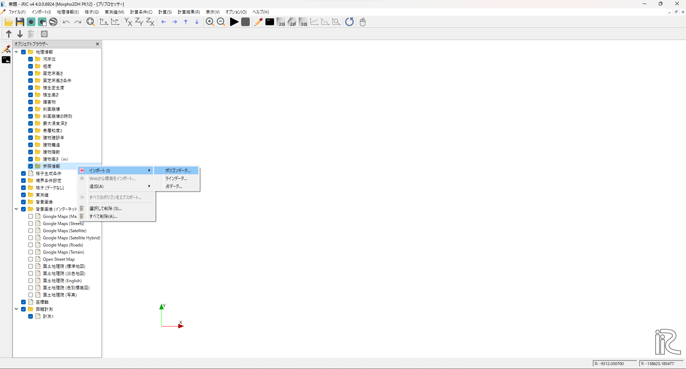

### 計算条件の設定
「計算条件」タブの「設定」をクリックし、計算条件を設定します。

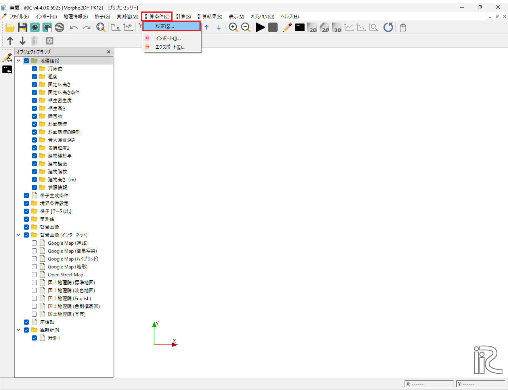

ここでは、1.計算の種類・タイムステップ・データ出力時間、2.土石流の諸元、3.河床材料の粒径、4.建物破壊の有無・建物破壊応力等を設定します。全ての計算条件の設定が終了したら、「OK」をクリックします。
1～3については、既存のiRIC Morpho2DHの機能と同様なので、チュートリアル参考としてください。

#### 1.計算の種類・タイムステップ・データ出力時間の設定
基本的にはチュートリアルのp17を参照してください。特記事項は以下のとおりです。
* 計算の種類：今回は「土石流・泥流」を選択してください。
* 終了時間(s)：計算範囲の大きさにより、必要な時間、即ち土石流が流下する時間が異なります。まずは100秒～200秒程度で設定し、不足すれば適宜時間を延長して再計算してください。
* タイムステップ(s)：格子の大きさが2m×2mの場合、0.001秒を推奨します。

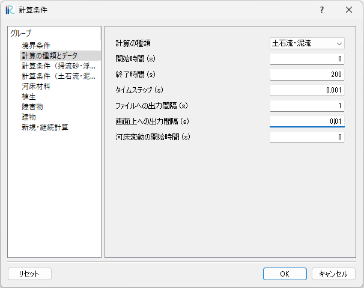

#### 2.土石流の諸元の設定
土砂濃度、土砂の密度等を設定します。基本的にはデフォルトの値で問題ありません。詳細はチュートリアルのp18を参照してください。
なお、砂防ダムなどの浸食されない河川・砂防構造物が存在する場合、「固定床高さ」では「使用する」を選択し、チュートリアルのp29～p32の方法で固定床高さを設定してください。

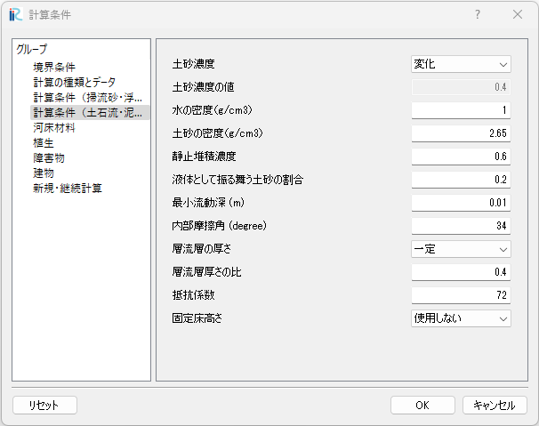

#### 3.河床材料の粒径の設定
河床材料の種類は、基本的には「一様砂」で問題ありません。平均粒径は、渓流の地質や河床勾配等により変動するので、現地調査を行って設定します。現地調査による平均粒径の設定方法は、[こちら](../resources/originalSimuHowTo/03_現地調査による平均粒径の設定方法.pdf)を参照してください。
現地調査を行わない場合、平均粒径は0.01(m)を基本とします。

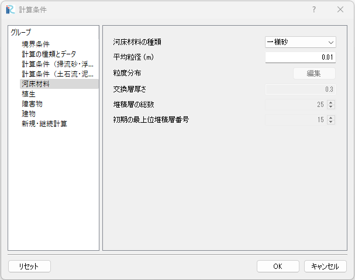

#### 4.建物破壊の有無・建物破壊応力の設定
既存のiRIC Morpho2DHにない機能です。建物破壊を考慮した計算を行う場合、建物破壊は「使用する」を選択し、建物破壊応力を編集します。行を2行追加し、コードと限界破壊応力を入力します。建物破壊応力は、木造相当（コード1）は500N/m2、鉄筋コンクリート造相当（コード7）は4,000 N/m2とします。

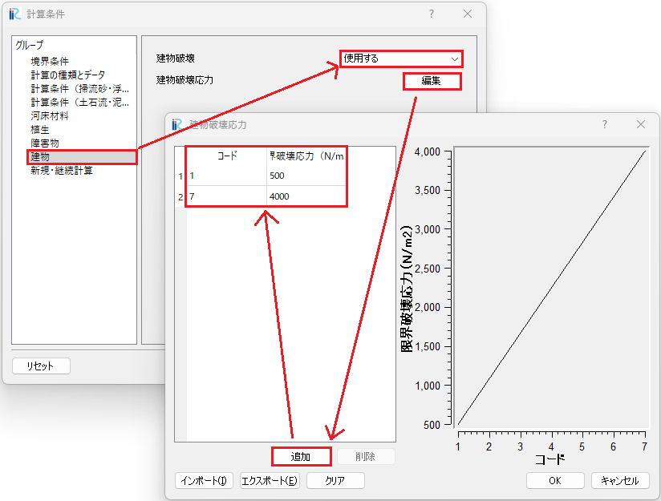

### 計算（シミュレーション）の実行
「計算」タブの「実行」をクリックし、計算を実行します。実行ボタンを押すと、プロジェクト保存の「情報」が表示されるので、「はい」をクリックします。
なお、処理時間は、計算範囲の大きさや計算時間の長さにより変動しますが、数時間要する場合があります。

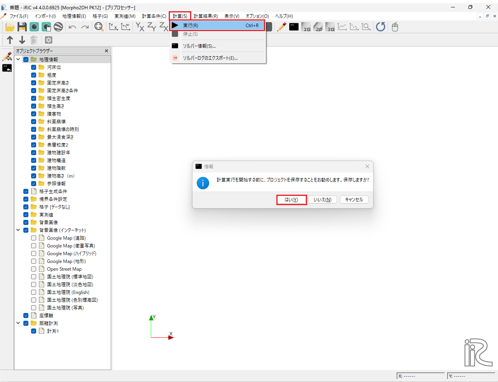

計算実行中は、灰色画面のソルバーコンソールが起動します。計算中に途中までの計算結果を確認したいときは、「計算結果の再読み込み」をクリックした後に、計算結果の描画作業を行います。

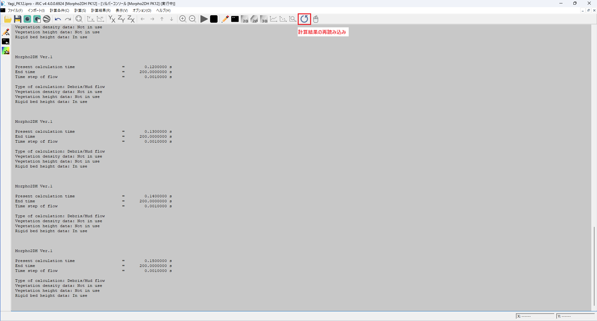

## 計算結果の確認方法
### iRIC上での確認
計算終了後、「2D可視化ウインドウ」を開くと、iRIC上で計算結果を2次元的に確認することができます。詳細はチュートリアルのp25～p27を参照してください。
確認可能な計算結果は、土石流の流動深（Depth）、流体力（FBuilding）、建物の倒壊判定（Building）等です。「アニメーションツールバー」を操作すると、計算結果を動画で確認できます。流動深（Depth）、流体力（FBuilding）の最大値を包絡したものを表示したい場合は、それぞれ「Depthmax」「FBuildingMax」を選択してください。
また、計算結果と土砂災害警戒区域を重ね合わせて表示する場合は、「オブジェクトブラウザー」の「地理情報」の「参照情報」をチェックしてください。（参照情報の入力については[こちら](#8%E5%8F%82%E7%85%A7%E6%83%85%E5%A0%B1%E5%9C%9F%E7%A0%82%E7%81%BD%E5%AE%B3%E8%AD%A6%E6%88%92%E5%8C%BA%E5%9F%9F%E3%81%AE%E8%AA%AD%E3%81%BF%E8%BE%BC%E3%81%BF)を参照してください。）この際、「地理情報」の「参照情報」以外の項目はチェックを外すことで、表示が煩雑になるのを防ぎます。

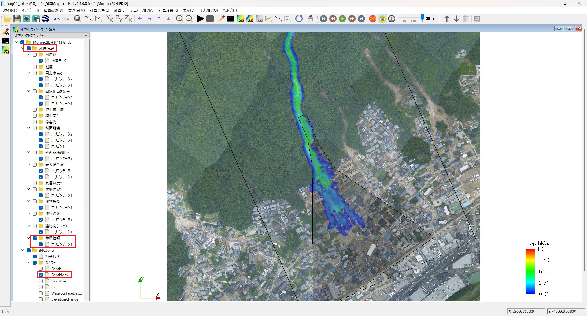

なお、建物の倒壊判定（Building）の値は、倒壊が0.5、非倒壊が1.0となっており、倒壊が赤、非倒壊を黄色とすると下図のように表示できます。

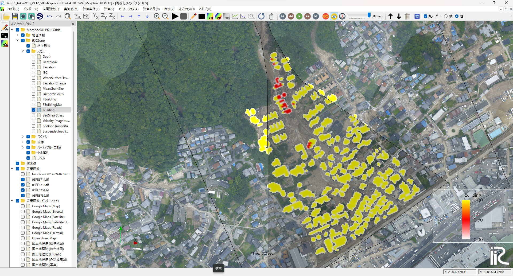

### 専用ビューアでの結果確認
iRIC上では2次元的に計算結果を確認できますが、3次元的に計算結果を確認する場合は、3次元可視化ビューワを使用します。作業手順は以下のとおりです。

#### 1.計算結果をCSV出力
「計算結果」タブの「エクスポート」をクリックし、形式はCSVファイルを選択し、出力フォルダを指定します。出力したい時刻・領域を指定することもできます。

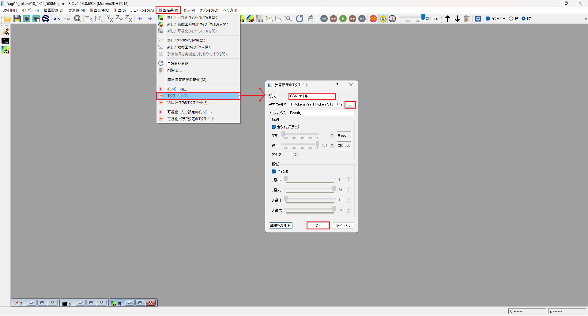

#### 2.出力したCSVを可視化コンバータによりCZMLに変換
詳細は可視化コンバータの説明を参照してください。

#### 3.変換したCZMLを3次元可視化ビューワに読み込み
詳細は3次元可視化ビューワの説明を参照してください。